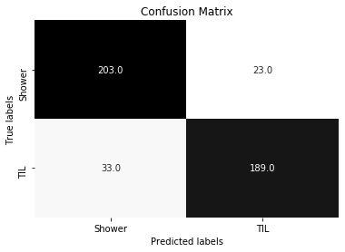

# Catching Plagiarism

## Problem Statement
A plagiarism company has come to us hoping we can identify plagiarized concepts rather than just copy-pasted words. Using NLP, we can look for clues in language structure and content to differentiate between original and learned ideas.

In order to tackle this problem we will scrape reddit for learned and original content using the subreddits Today I Learned and Shower Thoughts respectively. We then use predictive modeling to classify the content as learned or original, and evaluate the results so we can deploy an appropriate separation threshold. 

Simple Unit Testing and Logging are included for deployment.

## Executive Summary
In order to build an idea-plagiarism model, we used **Reddit data** from **ShowerThoughts** and **Today I Learned**, which contains **1504 observations**. This information pertains to subreddit titles pulled on October 17, 2019. 

We used several models to classify this data into their categories, the best one being a **MLPClassifier**. In order to optimize this model, we used an extensive grid search with FeatureUnion vectorizers (tfidf and cvec).

The resulting train and tests score were 0.84 and **0.86**. At the 0.5 threshold, the **precision was 0.83** and the **recall was 0.92**.

We then set up a simple threshold modifier to suit the clients needs. For instance, we might want to be more severe with papers for publication than we would want to be on high school students. 

## Summary of Reddit Characteristics

### Clean Text Total Word Count Distribution

<iframe width="900" height="800" frameborder="0" scrolling="no" src="//plot.ly/~ambar132/36.embed"></iframe>

*Click on the figure for zooming in or out and other interactive features*

 

### Clean Text Total Word Count Distribution

<iframe width="900" height="800" frameborder="0" scrolling="no" src="//plot.ly/~ambar132/38.embed"></iframe>

*Click on the figure to isolate words and other interactive features*

 

## Model

### Diagram

### Confusion Matrix for 0.5 Threshold

### Classification Probabilities

We can see our model is highly confident for most of the true predictions, which is great.

## Conclusion and Recommendations
We conclude that this model works at approximately 85% accuracy, where the recall can be maximized by setting the classification threshold. We recommend high thresholds for serious publications being checked for idea-plagiarism, and a lower one for students.

Future directions could include analyzing longer texts and data from different periods, since the current model might not hold with that data.

In order to improve the model, we could also combine topic modeling and word embedding using Generative Topic Embedding and then classify accordingly.